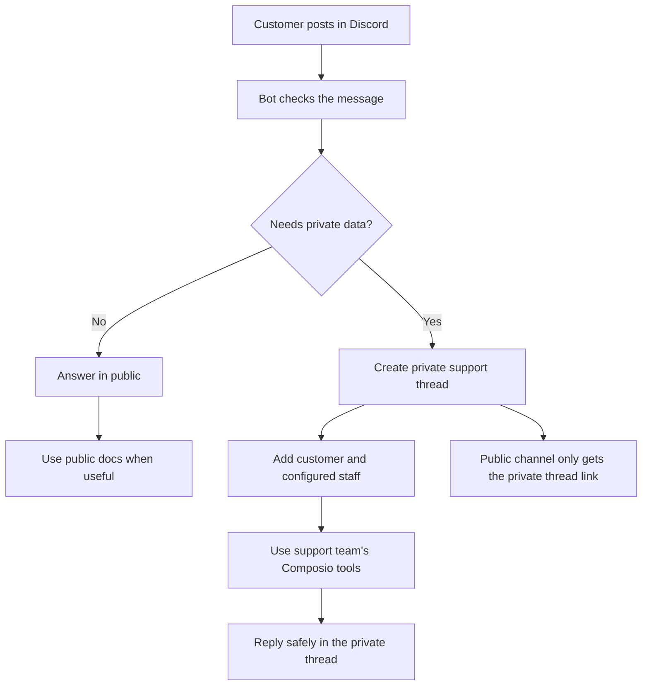

# Eve + Composio Discord Support Bot

A Discord customer-support bot example built with Composio Sessions, AI SDK 7,
and Eve-ready agent dependencies.

It shows how to:

- Use `composio.create(userId)` for a support-team tool session.
- Keep public Discord replies separate from private support diagnostics.
- Run private diagnostics through a support-team Composio user.
- Use public docs search for product questions and private tool access for sensitive debugging.
- Look up current Composio toolkits, tools, schemas, scopes, and versions from the Composio API.

## Main Pattern

```ts
const composio = new Composio({ apiKey: process.env.COMPOSIO_API_KEY });
const session = await composio.create("support-team", {
  toolkits: {
    enable: ["composio_search", "datadog", "metabase"],
  },
});

// The bot exposes AI SDK 7 tools that call:
const matches = await session.search({ query: "search Composio docs" });
await session.execute(matches.results[0].primaryToolSlugs[0], {
  query: "site:docs.composio.dev sessions",
});
```

## How It Works



Customers do not connect your internal tools. Your support team connects tools
for `SUPPORT_SESSION_USER_ID`, and the bot uses those tools only in private
support threads.

Datadog and Metabase are just example support tools. Replace them with whatever
your team uses for logs, dashboards, tickets, CRM, or escalation.

## Setup

```bash
npm install
cp .env.example .env
```

Fill in the required values:

```txt
DISCORD_TOKEN=
COMPOSIO_API_KEY=
OPENAI_API_KEY=
```

Then configure the support surfaces and staff users you want the bot to use:

```txt
SUPPORT_CHANNEL_IDS=
DEFAULT_STAFF_USER_IDS=
PRIVATE_DIAGNOSTICS_CHANNEL_ID=
SUPPORT_SESSION_USER_ID=support-team
COMPOSIO_TOOLKITS=composio_search,datadog,metabase
PUBLIC_DOCS_TOOLKITS=composio_search
```

See [.env.example](./.env.example) for all optional settings.

## Run

```bash
npm run dev
```

The bot responds to DMs, direct mentions, and configured support channels. If
`SUPPORT_CHANNEL_IDS` is empty, it responds to every guild message, so set it in
real servers.

The bot needs Discord permissions to send messages, create private threads, and
add the customer plus staff members to private threads. If private thread setup
fails, it does not run internal tools.

## Connect Support Tools

Connect the toolkits in `COMPOSIO_TOOLKITS` for the support-team user:

```bash
npm run connect:toolkits
```

The default is intentionally small:

```txt
composio_search,datadog,metabase
```

Use `composio_search` for public docs lookup. Keep internal systems such as logs,
dashboards, account lookup, ticketing, and escalation tools in `COMPOSIO_TOOLKITS`
so they are available only in private diagnostics mode.

## Optional Debug Fields

Customers or staff can include any clues they have. None are required.

```txt
@project_id: pr_your_project_id
@org_id: org_your_workspace_id
@user_id: user_123
@request_id: req_123
@log_id: log_123
@toolkit: github
@error: 403 permission denied
```

Attachments are treated as private by default. The bot opens a private support
thread with the customer and support staff before reading small text-like files.

## Key Files

- [src/composio/session.ts](./src/composio/session.ts): Composio Sessions setup.
- [src/discord/listeners.ts](./src/discord/listeners.ts): Discord event flow.
- [src/support/agent.ts](./src/support/agent.ts): support agent prompt and model call.
- [src/support/privacy.ts](./src/support/privacy.ts): public vs private routing.
- [knowledge/](./knowledge): editable support knowledge.
