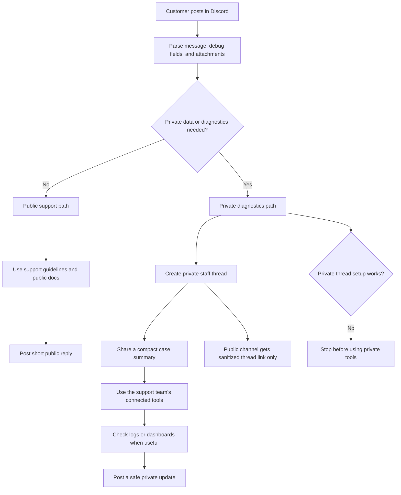

# Composio Discord Support Bot

An updated Composio example inspired by `ComposioHQ/auri-discord-bot`, focused on customer support.

The bot listens in Discord, triages support requests, reads local Composio runbooks, and uses [Composio Sessions](https://docs.composio.dev/docs/configuring-sessions) to access your support stack.

## What It Demonstrates

- Current Composio Sessions APIs: `composio.create(userId)` and `session.tools()`.
- A support-team identity for internal tools.
- Public docs lookup through Composio Search.
- Bring-your-own diagnostics through configurable toolkits such as Datadog and Metabase.
- Runbook-grounded support behavior.
- Discord support workflows: public triage, private diagnostics threads, staff routing, and escalation summaries.

Customers in Discord do not connect your internal tools. Your support team connects tools for the configured support identity.

Private diagnostics never run directly in public channels. If a request includes private identifiers or asks for internal diagnostics, the bot creates a private staff thread, adds the configured staff users, and only then uses Composio tools.

File attachments are treated as private by default. The bot opens a private staff thread before reading small text-like files or summarizing attachment context.

## Setup

Install dependencies:

```bash
npm install
```

Create an env file:

```bash
cp .env.example .env
```

Fill in:

```txt
DISCORD_TOKEN=...
COMPOSIO_API_KEY=...
OPENAI_API_KEY=...
```

Choose your support toolkits:

```txt
COMPOSIO_TOOLKITS=composio_search,datadog,metabase
PUBLIC_DOCS_TOOLKITS=composio_search
SUPPORT_SESSION_USER_ID=support-team
```

Configure who gets added to private diagnostics threads:

```txt
DEFAULT_STAFF_USER_IDS=111111111111111111,222222222222222222
AUTH_STAFF_USER_IDS=333333333333333333
BILLING_STAFF_USER_IDS=444444444444444444
INFRA_STAFF_USER_IDS=555555555555555555
DIAGNOSTICS_STAFF_USER_IDS=666666666666666666
PRIVATE_THREAD_NAME_PREFIX=support-debug
```

If your team uses different internal systems, replace the toolkit list with your own Composio toolkit slugs. Keep the default small while you are getting started, then add escalation toolkits such as GitHub, Linear, Slack, or Gmail only when the bot needs them.

## Run

```bash
npm run dev
```

The bot responds to:

- DMs.
- Direct mentions.
- Messages in `SUPPORT_CHANNEL_IDS`, if configured.
- Every guild message when `SUPPORT_CHANNEL_IDS` is empty.

For production servers, set `SUPPORT_CHANNEL_IDS` so the bot only watches support channels.

The bot needs Discord permissions to send messages, create private threads, and add members to private threads. If it cannot create the thread or add the right staff users, it fails closed and does not run diagnostics. Follow-up commands inside private diagnostics threads only run for configured staff users.

### Discord Forum Channels

`SUPPORT_CHANNEL_IDS` can include Discord forum channel IDs. The bot will respond inside forum posts under that forum.

Discord forum posts are public threads, and Discord cannot convert them into private threads or create private threads inside them. If private diagnostics are needed from a forum post, configure a normal text channel where private diagnostics threads should be created:

```txt
SUPPORT_CHANNEL_IDS=123456789012345678
SUPPORT_FORUM_AUTHOR_IDS=234567890123456789
PRIVATE_DIAGNOSTICS_CHANNEL_ID=345678901234567890
```

`SUPPORT_FORUM_AUTHOR_IDS` is optional. It is useful for testing because it limits auto-responses to forum posts created by specific Discord users.

## Support Flow



In short:

1. A customer posts a support issue in Discord.
2. The bot parses the message, debug fields, and attachments.
3. Public-safe issues stay public and may use public Composio docs search.
4. Private identifiers, attachments, explicit log checks, or internal diagnostics requests move into a private staff thread.
5. Private threads receive a compact handoff, not broad public-channel history.
6. Private diagnostics use the tools your support team connected in Composio.
7. Discord replies suppress URL embeds by default to keep support threads readable.

Datadog and Metabase are optional private support tools in this example. They
are connected by the support team, not by Discord customers, and the bot only
uses them inside private staff threads.

Private-thread triggers include real organization IDs, user IDs, session IDs, connected account IDs, auth config IDs, request IDs, Composio log IDs, trace IDs, UUIDs, email addresses, Datadog, Metabase, internal logs, explicit log checks, and database queries.
File attachments also trigger a private thread.

Private thread names use the configured prefix, routing category, and the best available debug clue, such as `support-debug-account-ok-waou8bjo73ly` or `support-debug-infra-pr-xtim-6kfdiir`.

## File Attachments

The bot supports Discord attachments in support messages:

- In public channels, attachments always move the request into a private diagnostics thread.
- In private threads, staff can attach screenshots, logs, JSON, CSV, Markdown, or text files.
- Small text-like files are fetched and passed to the private agent for summarization.
- Large files and binary files are preserved as metadata and Discord links.

Tune limits with:

```txt
ATTACHMENT_MAX_FILES=5
ATTACHMENT_MAX_BYTES=1000000
ATTACHMENT_TEXT_MAX_CHARS=12000
```

## Optional Debug Fields

Users can include structured clues in any support message:

```txt
@project_id: pr_your_project_id
@org_id: org_your_workspace_id
@org_member_email: user@example.com
@user_id: user_123
@environment: production
@time_window: last 2 hours
@toolkit: datadog
@tool: DATADOG_SEARCH_LOGS
@log_id: log_your_tool_execution_log
@error: 403 permission denied
```

These fields are optional. The bot extracts what is present, investigates when it has enough signal, and asks for only the missing clue it needs next. See `knowledge/debug-fields.md` for supported fields and where users can find them.

## Staff Routing

Routing is intentionally simple and env-based for the public example:

- Auth, OAuth, connected account, token, scope, 401, or 403 issues route to `AUTH_STAFF_USER_IDS`.
- Billing, invoice, subscription, payment, Stripe, refund, or plan issues route to `BILLING_STAFF_USER_IDS`.
- Datadog, logs, traces, 5xx, latency, timeout, incident, production, or staging issues route to `INFRA_STAFF_USER_IDS`.
- Metabase, dashboard, query, analytics, org, user, or session lookups route to `DIAGNOSTICS_STAFF_USER_IDS`.
- Every private thread also includes `DEFAULT_STAFF_USER_IDS`.

If no users resolve for a route, diagnostics do not run.

For public cases that do not need private diagnostics but look blocked, urgent, incident-shaped, billing-related, or owner-actionable, the bot can tag the routed staff users in the public reply. Private diagnostics threads always tag the routed staff users inside the private thread.

## Private Thread Handoff Context

When the bot opens a private diagnostics thread, it carries over a compact case
handoff instead of dumping broad public-channel history:

- The public message URL.
- The route and reason the case moved private.
- The triggering customer report, truncated if long.
- Parsed debug fields.
- Attachment metadata and extracted text for small text-like files.

The private agent receives this same compact case context. It does not receive
the full recent public channel history by default, which helps avoid stale
context from nearby support tests or unrelated messages.

## Bring Your Own Datadog And Metabase

This repo does not hard-code Composio's internal dashboards or logs. Datadog and
Metabase are included to show the pattern: connect the private tools your
support team already uses, then let the bot call them only after a case has
moved into a private diagnostics thread.

Datadog and Metabase are examples of private support tools:

- Datadog is useful for logs, traces, errors, latency, and incident checks.
- Metabase is useful for support dashboards, account state, usage, or other
  internal operational views.
- Customers do not connect either tool. The support team connects them once for
  `SUPPORT_SESSION_USER_ID`.
- If your team uses different systems, replace these toolkit slugs with your
  own log, dashboard, CRM, ticketing, or database tools.

To use your own diagnostics:

1. Keep `datadog` and `metabase` in `COMPOSIO_TOOLKITS`, or replace them with your internal toolkit slugs.
2. Connect those tools in Composio for `SUPPORT_SESSION_USER_ID`.
3. Edit `knowledge/diagnostics/*.md` with your team's dashboard names, log fields, and escalation rules.
4. Configure staff user IDs so private investigations reach the right people.

The bot will use the tools exposed by `session.tools()` and the guidance in the runbooks.

## Optional Escalation Toolkits

The default setup keeps Composio tools focused on docs and diagnostics:

```txt
COMPOSIO_TOOLKITS=composio_search,datadog,metabase
```

Add extra toolkits when you want the bot to take follow-up actions:

- `github`: look up or create engineering issues.
- `linear`: file product and engineering escalation tickets.
- `slack`: notify internal support or incident channels.
- `gmail`: inspect support email context or draft follow-ups.

## Public Docs Search

The bot can use Composio Search in public Discord replies to look up public docs before answering:

```txt
PUBLIC_DOCS_TOOLKITS=composio_search
```

The support prompt tells the agent to prefer official Composio docs, search `docs.composio.dev` or `https://docs.composio.dev/llms.txt`, and cite docs URLs when tool results provide them.

Keep internal tools such as Datadog, Metabase, logs, dashboards, account lookups, and database queries out of `PUBLIC_DOCS_TOOLKITS`. Those belong in `COMPOSIO_TOOLKITS` and only run in private diagnostics threads.

## Offline Sanitized Support Memory

This repo includes optional tooling for turning resolved Plain threads into
privacy-safe support patterns:

```txt
knowledge/support-memory/cards.json
```

The live Discord bot does not load these cards by default. Keep the runtime
grounded in docs, runbooks, current Discord context, and private diagnostics
evidence. Use support-memory cards only for offline analysis or after you
explicitly choose to wire them into your own deployment.

Each card captures reusable support knowledge:

- Symptoms.
- Likely causes.
- Fixes.
- Evidence to ask for.
- What not to mention.

Validate checked-in cards before committing changes:

```bash
npm run validate:support-memory
```

The validator fails if cards contain emails, request IDs, org IDs, project IDs, connected account IDs, auth config IDs, API keys, UUIDs, Plain thread IDs, or non-Composio URLs.

### Build Local Cards From Plain

If you connect Plain for your own team, you can generate local sanitized cards:

```bash
npm run build:support-memory
```

By default, generated cards are written to `generated-support-memory/`, which is gitignored. Review those cards manually before copying any generalized pattern into `knowledge/support-memory/cards.json`.

Useful settings:

```txt
SUPPORT_MEMORY_MODEL=gpt-5.5
SUPPORT_MEMORY_OUTPUT=generated-support-memory/cards.json
SUPPORT_MEMORY_MAX_THREADS=10
SUPPORT_MEMORY_DAYS_BACK=30
SUPPORT_MEMORY_PLAIN_STATUSES=DONE
SUPPORT_MEMORY_PLAIN_VERSION=20260615_00
SUPPORT_MEMORY_PLAIN_CONNECTED_ACCOUNT_ID=
SUPPORT_MEMORY_PLAIN_TIMELINE_ENTRIES=40
```

## Offline Support Eval

Run an offline eval against recent Plain support issues:

```bash
npm run eval:support
```

The eval does not post to Discord or Plain. It pulls `DONE` support threads from Plain, extracts the original customer issue and later timeline evidence, generates fresh bot answers using `EVAL_OPENAI_MODEL` (default `gpt-5.5`), compares them with the actual Plain resolution, and writes artifacts to `eval/plain-diagnostics-YYYY-MM-DD/`.

`npm run eval:support-forum` is kept as a compatibility alias, but Plain is the canonical source because Discord support posts are mirrored into Plain.

By default, the eval runs in private diagnostics mode with Datadog and Metabase enabled. That lets it test whether the bot checked internal logs or analytics when those tools would materially help.

Useful settings:

```txt
EVAL_OPENAI_MODEL=gpt-5.5
EVAL_USE_PRIVATE_TOOLS=true
EVAL_TOOLKITS=composio_search,datadog,metabase
EVAL_DAYS_BACK=30
EVAL_MAX_THREADS=0
EVAL_CONCURRENCY=3
EVAL_OUTPUT_NAME=
EVAL_PLAIN_STATUSES=DONE
EVAL_PLAIN_VERSION=20260615_00
EVAL_PLAIN_CONNECTED_ACCOUNT_ID=
EVAL_PLAIN_MAX_PAGES=10
EVAL_PLAIN_TIMELINE_ENTRIES=100
EVAL_PLAIN_MIN_TEXT_ENTRIES=2
EVAL_RESOLUTION_EVIDENCE_MAX_CHARS=60000
```

## Key Files

- `src/composio/session.ts`: Composio Sessions setup.
- `src/support/agent.ts`: Support agent prompt and AI SDK call.
- `src/support/debug-fields.ts`: Optional `@key: value` debug-field parser.
- `src/support/privacy.ts`: Private diagnostics classifier and staff routing.
- `src/support/support-memory.ts`: Optional offline support-memory schema and privacy checks.
- `src/discord/listeners.ts`: Discord message handling.
- `src/discord/private-thread.ts`: Private thread creation and staff member adds.
- `knowledge/`: Support and diagnostics runbooks.
- `knowledge/support-memory/cards.json`: Optional curated synthetic support-memory examples.
- `knowledge/known-incidents-and-status.md`: Incident-first support guidance.
- `knowledge/mcp-auth-triage.md`: MCP, OAuth, API key, and connected-account triage.
- `knowledge/support-response-quality.md`: Response quality and escalation-language rules.
- `docs/plans/2026-06-22-customer-support-bot-design.md`: Design note.
- `docs/plans/2026-06-22-private-diagnostics-threads-design.md`: Private diagnostics design note.
- `docs/plans/2026-06-22-support-forum-eval-design.md`: Offline eval design note.

## Current Composio Pattern

```ts
const composio = new Composio({ provider: new VercelProvider() });
const session = await composio.create("support-team", {
  toolkits: {
    enable: ["composio_search", "datadog", "metabase"],
  },
});
const tools = await session.tools();
```

Use this pattern for new Composio examples. Avoid older tool-router examples unless you are maintaining legacy code.
